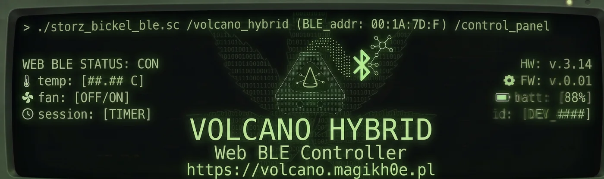

# volcano-hybrid-control



Control a **Storz &amp; Bickel Volcano Hybrid** straight from your browser over
**Web Bluetooth** — no app, no backend, no Home Assistant. The browser is the BLE
central and talks to the device's GATT directly; nothing leaves your machine.

One HTML file, one stylesheet, one script. No build step, no dependencies.

**[▶ Live version](https://magikh0e.pl/pubHomeAutomation/volcano-control.html)**

---

## Run it

Web Bluetooth only works in a **secure context** — HTTPS, or `http://localhost`.
Opening `index.html` from the filesystem (`file://`) won't work. Serve the folder:

```
python3 -m http.server 8000
# then open http://localhost:8000
```

…or drop the three files (`index.html`, `volcano.css`, `volcano-ble.js`) on any
static host that serves HTTPS. That's the whole deploy.

## Browser support

| Platform | Works |
|---|---|
| Chrome / Edge / Opera (desktop) | ✅ |
| Chrome (Android) | ✅ |
| Firefox, Safari | ❌ — no Web Bluetooth |
| iOS (any browser) | ❌ — WebKit has no Web Bluetooth |

You also need to be **within Bluetooth range** of the Volcano — this is local
control, not remote. And the Volcano allows a **single BLE connection at a time**,
so disconnect Home Assistant or the S&amp;B app first (or vice-versa).

## What it does

- **Connect** with a device picker filtered to the Volcano (falls back to name
  prefixes if the control service isn't advertised).
- **Temperature** — live current temp via GATT notifications, ± target stepper,
  set target (clamped 40–230 °C).
- **Heat / Fan** toggles, with LEDs that reflect the device's real state (read
  back from the `PRJSTAT1` register every ~2 s, not just what you clicked).
- **Vapesuvius presets** — one-tap jump to any rung (179–230 °C).
- **Run ladder** — turns heat on and walks 179 → 230 °C, one rung every 5 min
  (~35 min) with a live countdown.
- **Fill bag** — runs the pump 41 s (standard S&amp;B Easy Valve) with a countdown
  and auto-stop.
- **Device info** — serial number, Volcano firmware, Bluetooth firmware, hours
  of operation.
- **Settings** — auto-off timer, LED brightness %, display units (°C/°F),
  show-temperature-while-cooling, and vibration alert. "Heat on connect" is
  remembered in `localStorage`.

> ⚠️ **It's a 230 °C heater.** The page clamps the range and confirms before
> turning heat on, but don't walk away from a running unit.

## Protocol

Everything is plain GATT reads/writes. Control characteristics live under service
`10110000-5354-4f52-5a26-4249434b454c` — the UUID tail spells `STORZ&BICKEL` in
ASCII. Status/registers live under `10100000-…`.

| what | char | I/O |
|---|---|---|
| current temp | `…0001` | read / notify, uint16 LE ÷ 10 |
| set temp | `…0003` | write (target × 10), uint16 LE |
| heat on / off | `…000f` / `…0010` | write `[1]` / `[0]` |
| fan on / off | `…0013` / `…0014` | write `[1]` / `[0]` |
| auto-off | `…000d` | write seconds (min × 60), uint16 LE |
| LED brightness | `…0005` | write 0–100, uint16 LE |
| heat hours / minutes | `…0015` / `…0016` | read, uint LE |
| serial / fw / BLE fw | `10100008` / `10100005` / `10100004` | read, UTF-8 |
| `PRJSTAT1` | `1010000c` | read — heat `0x20`, pump `0x2000` |
| `PRJSTAT2` | `1010000d` | °F `0x200`, display-on-cooling `0x1000` |
| `PRJSTAT3` | `1010000e` | vibration `0x400` |

The `PRJSTAT2`/`PRJSTAT3` toggles are **active-low** (a feature is *on* when its
bit is *clear*), written 4-byte little-endian with a set/clear convention: write
the mask alone to **clear** the bit, or `0x10000 | mask` to **set** it. These
change the Volcano's own screen and buzzer, not the web panel — the device always
reports temperature in °C over BLE regardless of display units.

## Credits

BLE protocol reverse-engineered by
[**SavageNL/home-assistant-volcano-hybrid**](https://github.com/SavageNL/home-assistant-volcano-hybrid) —
this is a dependency-free browser reimplementation of the parts it documents.

Not affiliated with, endorsed by, or supported by Storz &amp; Bickel. Use at your
own risk.

— by [magikh0e](https://magikh0e.pl)
